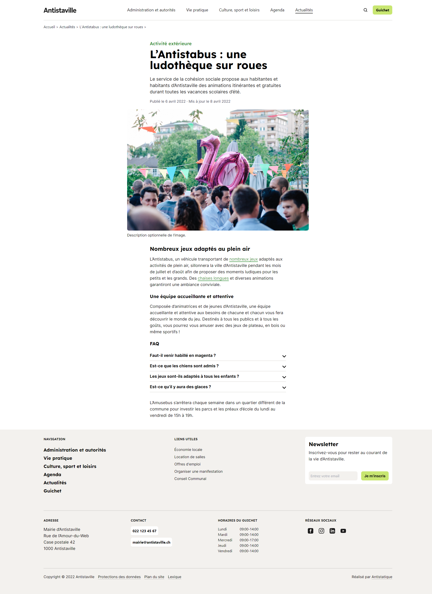

# Exercise Antistaville

## Guidelines
Figma to HTML with Tailwind CSS.

Overview of the website


Voir le résultat en [ligne](https://exercice-antistaville.cb-dauvier.fr/)

## Time estimation and counting
* Estimated cost for the project => 20h
* Real time spent on the project  => 16h

## Get the project

* You can get the application with git command ```git clone https://github.com/Boris74000/exercice-antistaville.git``` or by downloading [zip](https://github.com/Boris74000/exercice-antistaville/archive/refs/heads/main.zip)

## Install application

- Download and install [Node.js](https://nodejs.org/fr/download/ "download node.js").
- Check that Node.js is installed with this command line ```node -v ```.
- At the root of the downloaded and unzipped project, use this command ``npm install`` to install the dependencies.
- Open the index.html file inside public directory with your browser.

## Technologies

- Tailwind css 3.1.6
- Html
- Css
- JavaScript